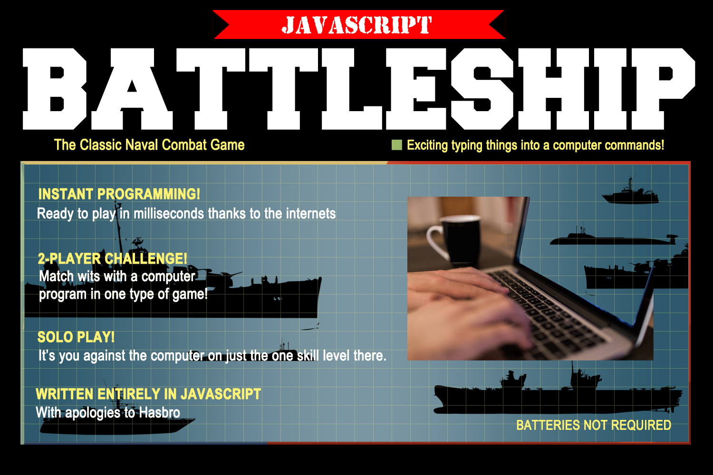
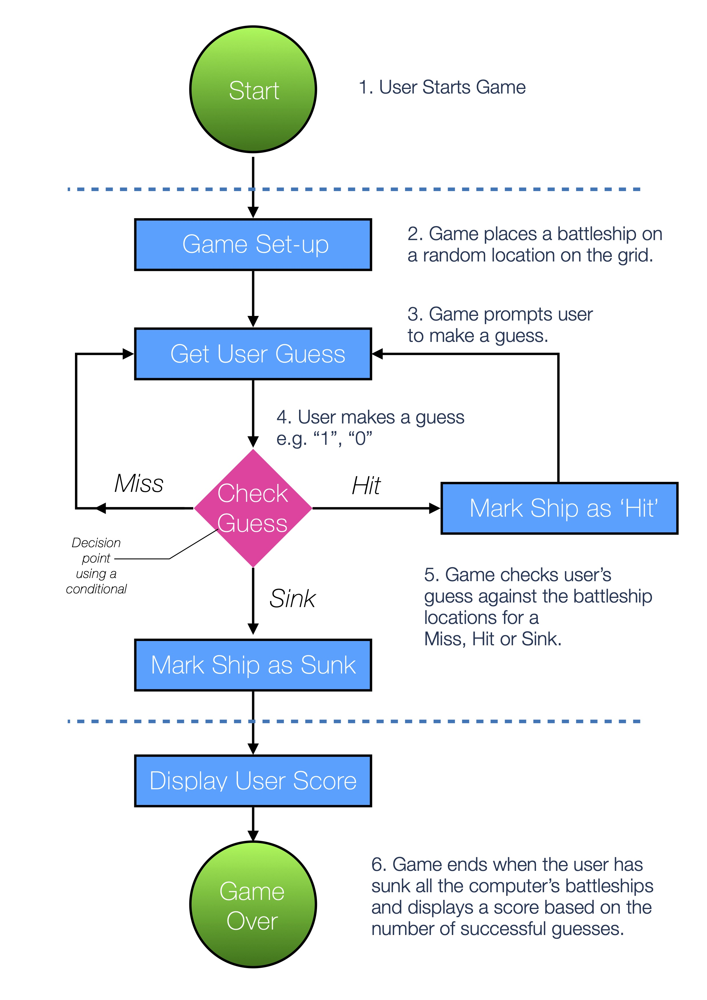

# JavaScript Battleship!

Back in the early 1990s, every so often my brother and I would open up something about the size of a briefcase, load in the eight or so AA batteries it needed and played <a href="https://www.youtube.com/watch?v=CZ2Qj4VrqIw"> Electronic Battleship </a>.

## Installation instructions

Just download the repo and open battleship.html and play!

I built this JavaScript version both out of nostalgia and 
to practice programming using JavaScript. 

## Design

In the first instance, I opted for a ship that occupies three grid spaces on the board. e.g. A1 A2 and A3

In order for the game to work we need a few variables in place first:

### guess

The variable that contains the user’s current guess, undefined until a user enters two numbers – an array of two integers.

### guesses  

Initially set to zero, a counter to add up the number of user guesses and calculate the final scores.

### location1, location2, location3

 A series of grid co-ordinates per ship.

### isSunk 

A boolean (a datatype that is either ‘true’ or ‘false’). It will tell us whether a ship has been sunk or not. This will be set to false at the start of each game

Battleship itself needs a ‘while loop’ in order to keep taking guesses from the user.

* While the computer opponent’s battleships are not sunk, continue to take guesses from the user.
Prompt for an input from the user (this could be a regular dialogue box for example).

If that guess is invalid, tell the user to enter a valid guess (so we’ll need some kind of validation backstage that also keeps track of pre-existing guesses).

If the guess is valid, then add one to the number of guesses made by the user, which will make up the score.

Provided the guess is valid, we then need to enter another conditional statement. If the user’s guess matches a ship location, add one to the number of  hits 

* If this number of hits is more than the length of the ship on the grid ( locations ), e.g. 3 for a cruiser, then set the isSunk boolean to true and display “You sank my battleship!”

Otherwise (‘else’) mark this guess as a ‘miss’.

Once the ‘while loop’ is complete and there are no remaining ships to sink, provide the user with their score, calculated using the total number of hits vs the total number of guesses.
