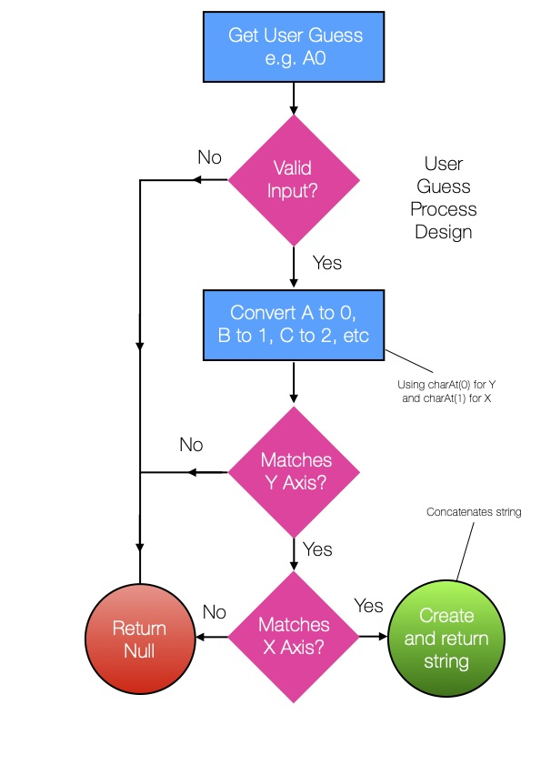

# JavaScript Battleship

Back in the early 1990s, every so often my brother and I would open up something about the size of a briefcase, load in the four AA batteries it needed and played <a href="https://www.youtube.com/watch?v=CZ2Qj4VrqIw"> Electronic Battleship </a>.

## Installation instructions

Just download the repo and open battleship.html and play!

## About

I built this JavaScript version both out of nostalgia and 
to practice programming using JavaScript. 

There are two versions, one with a simple alert dialogue box for guesses and a second version with a 7 x 7 grid.

# Version 2.0 

## Design

In this version I am moving the game from a basic dialogue box (alert) prompt for users to enter their guesses into an MVC / Model View Controller version.  

The view displays ships on a newly designed grid system.

The grid translates positions A B C D E F G into numbers 0 1 2 3 4 5 6

So A0 is 00, C2 is 22, D5 is 35, etc, etc.

As the user makes a guess, in the JS we getElementById and then change the relevant class name to update to 'hit' or 'miss' to then, via the CSS, to display either a ship for a 'hit' or the word 'miss' for a miss.

You can use the Ship Locations Tool in the excel folder to translate array values into ship positions and vice versa.

In the original game of Battleship, or the version that we owned as kids, SeaBattle, there is a 10 by 10 grid, offering players a grid of 100 spaces in which to place their ships. 

Carrier: 5 spaces
Battleship: 4 spaces 
Cruiser: 3 spaces
Submarine: 3 spaces
Destroyer: 2 spaces  

Each player therefore occupied 17 spaces.

Our grid is about half the size (7 x 7), meaning we want around half the number of spaces occupied.

So each player in our game occupies 9 spaces on the grid. 

For this we need views to display a hit miss or sink, a model for the position and size of ships and the grid and a controller that handles the user's guesses and to translate these guesses from a string of a letter and an integer (e.g. A5) into a straightforward number (e.g. 05), representing a space numbered 0 - 66 on the grid.

Spaces look like this:

01, 02, 03, 04, 05, 06  
10, 11, 12, 13, 14, 15, 16  
... 
50, 51, 52, 53, 54, 55, 56  
60, 61, 62, 63, 64, 65, 66 

The controller needs to validate and split the user's entry apart and translate these numbers before re-concatenating the string back together again to produce a result.

# Version 1.0 

## Design

In the first instance, I opted for a ship that occupies three grid spaces on the board. e.g. A1 A2 and A3

In order for the game to work we need a few variables in place first:

### guess

The variable that contains the user’s current guess, undefined until a user enters two numbers – an array of two integers.

### guesses  

Initially set to zero, a counter to add up the number of user guesses and calculate the final scores.

### location1, location2, location3

 A series of grid co-ordinates per ship.

### isSunk 

A boolean (a datatype that is either ‘true’ or ‘false’). It will tell us whether a ship has been sunk or not. This will be set to false at the start of each game

Battleship itself needs a ‘while loop’ in order to keep taking guesses from the user.

* While the computer opponent’s battleships are not sunk, continue to take guesses from the user.
Prompt for an input from the user (this could be a regular dialogue box for example).

If that guess is invalid, tell the user to enter a valid guess (so we’ll need some kind of validation backstage that also keeps track of pre-existing guesses).

If the guess is valid, then add one to the number of guesses made by the user, which will make up the score.

Provided the guess is valid, we then need to enter another conditional statement. If the user’s guess matches a ship location, add one to the number of hits 

* If this number of hits is more than the length of the ship on the grid ( locations ), e.g. 3 for a cruiser, then set the isSunk boolean to true and display “You sank my cruiser!”

Otherwise (‘else’) mark this guess as a ‘miss’.

Once the ‘while loop’ is complete and there are no remaining ships to sink, provide the user with their score, calculated using the total number of hits vs the total number of guesses.
